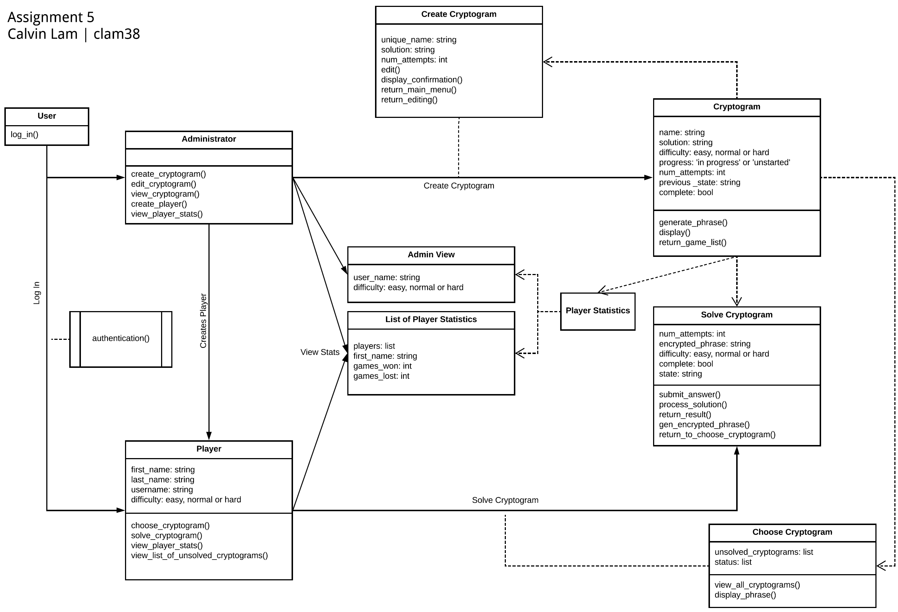
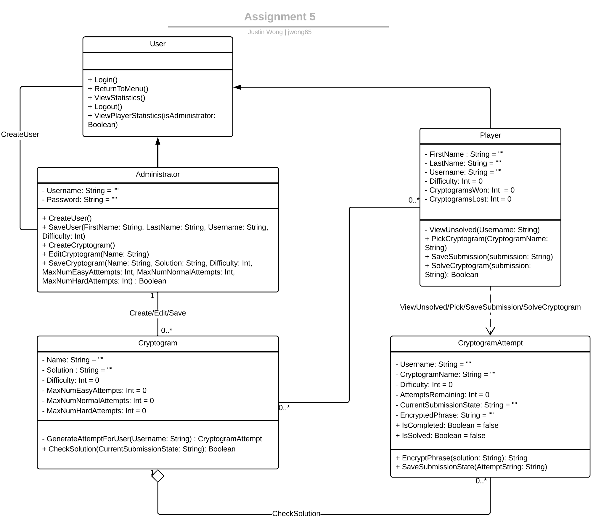
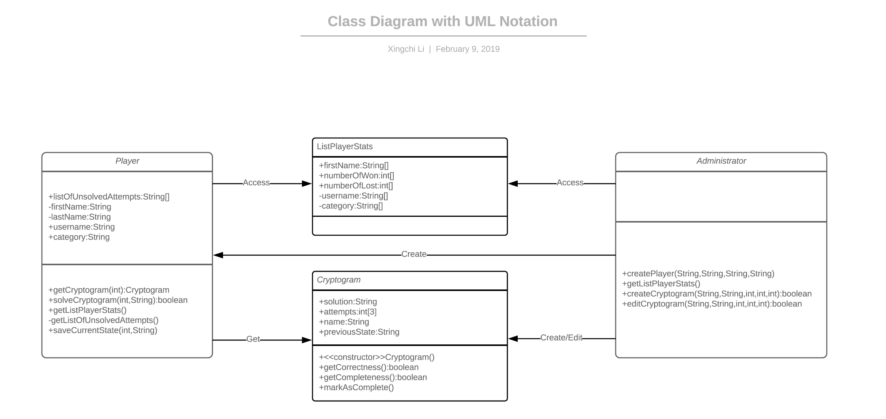
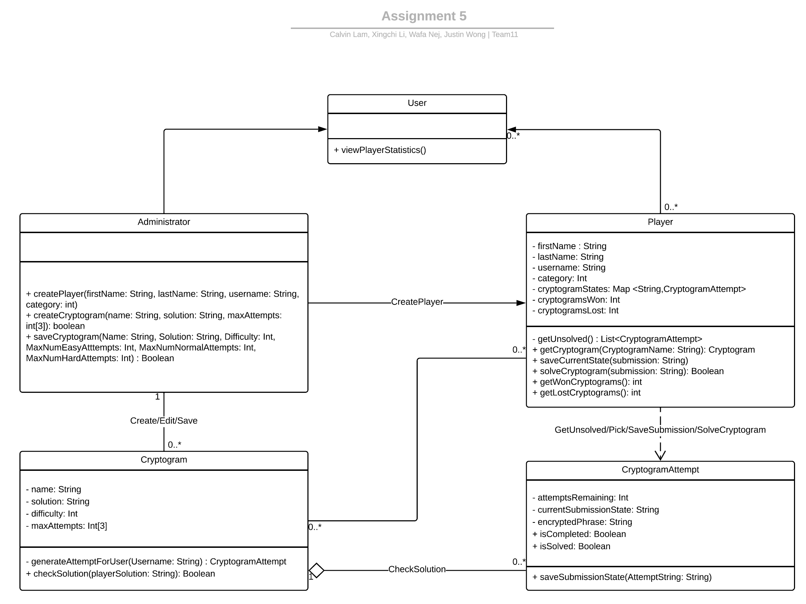

# **Design Discussion**

## Individual Designs

### **Design 1**

**Pros:**

*   The design has most of the attributes and methods needed to meet the requirements
*   Very clear UI/UX flow from the perspective of an app
*   Good use of dependencies/associations between all classes
*   Clear function names and availability of methods for each user

**Cons:**

*   `view_player_stats()` is repeated in two classes (Player and Administrator). I think it would be better to move it to User.
    * Here I have some disagreement. I don't think we should merge them into player class. The function return different outputs for player and administrator. If they are merged into player class, every time administrators access the list of player stats need to call the function from player class. And it seems a little complicated to make the function return more elements for administrator.

*   The `display()` methods and the AdminView are GUI related. According to requirements: "you do not have to show any purely GUI specific classes, if they are only doing user display and input and not performing any significant business logic."
*   Some class names are not nouns or noun phrases.
*   Not as clear on the specifics of the interactions between the various Cryptogram classes
*   Unsure if difficulty category/progress are strings/ints/enums/etc.
    * Enum would be a good choice! String and int are both viable and I don't think they have merits over each other.

*   Functions are missing parameters
*	Didn't have "+,-,\~,#,\_" etc to show the attributes as public or private or something else. Since we want some attributes to be private in case we made mistakes while implementation.

**Design 2**

**Pros:**

*   The CryptogramAttempt class and the relation checkSolution will help to save the Cryptogram status and player statistics
*   Includes use of multiplicity,
*   Separation of functions that are publicly/privately visible
*   Parameter named arguments and types

**Cons:**

*   Initializing strings to "" and numbers to 0. I don't see why we should do this.
*   No specific class for Player Statistics
*   Clarity required to understand the flow of generating the CryptogramAttempt along with the solution
*   Not all lines/dependencies/associations are included correctly
*   Some functions' returns are not explicit.

**Design 3**

**Pros:**

*   Clear usage of multiplicity relationships between entities
*   Great use of hashMaps to uniquely identify cryptograms, agreed!
*   Overall UML is understandable and not overly complicated

**Cons:**

*   The way PlayerStats is currently implemented, it appears it could be directly implemented in Player as opposed to being a separate class
*   The ability to Create a Player/Cryptogram from the Administrator is not explicitly clear in the UML although it is stated in the descriptions
*   Is it viable making list of player stats into database, since I don't think list of player stats is a class but I can't tell why... List of player stats functions like _time_ in the lecture P3L2 library example.

**Design 4**

**Pros:**

*   Clear classes, having the needed attributes and methods
*   Defines Player/Administrator as separate objects
*   Shows actionable relationships between classes
*	UML design is clear

**Cons:**

*   Seems to define Player/Administrator as separate classes without a inherited idea of a User class
*   Unclear if a cryptogram can be solved by multiple players or only be for a single player.  This is because there is a `markAsComplete()` function but it seems to imply that there is only a single copy.
*   Function parameters show type but unsure what the parameter names are
*	Some fucntions have overlaps

# Team Design

The template for our team design was lifted from Justin's (Design 2) diagram. From the discussion amongst the team members, Design 2 offered a simple and intuitive layout of the classes required and a large list of attributes and methods for us to add/remove to our team design. In addition, Design 3 also shared a similar idea on how to best represent the requirements making Design 2 an easy way to begin our final team design. All the designs have Player, Cryptogram and Administrator classes, and use similar attributes for these classes. And they agree on the relationships between Administrator-Cryptogram and Administrator-Player

## Differences

Every design represented The view `PlayerStatistics` requirement differently. Design1 includes two different methods `view_player_stats()` in both `Administrator` and `Player` classes, but it wasn’t clear how to get these statistics. Design2 proposed a `ViewPlayerStatistics(isAdministrator:bool)` in the User class Design3 proposed the `PlayerStats` as a separate class, but this  wasn’t needed since all the methods added in this class can be called from `Player` class. Design4 also proposed `ListPlayerStats` as a separate class. We decided that a class is not need to accomplish the view player statistics requirement, because the relationtionships Player-CryptogramAttempt , User-Player and User-Administrator allow us to get the needed statistics. We added a method `viewPlayerStatistics()` to User. And using override to make functions based on that.

### Design 1

The primary difference in Design 1 is that it's too abstract and lacked a focus on only the object oriented classes necessary for the system. This is seen through the inclusion of the Player Statistics class and the two user type specific UI screens. The final team design handle the player statistics view requirement with a simple inclusion of the `getListPlayerStats()` method. The complexity of which user type sees which screen wasn't necessary in the class diagram. Aside from the difference in class structure, Design 1 included many of the same attributes and methods as the final team design such as strings for name, solution, completed, etc.

### Design 2

As Design 2 became the template of our team design, it shares more similarities than differences. The final team design included detailed parameters to the existing methods of Design 2's classes. For example, `CreateUser()` became `CreatePlayer(firstName: String, lastName: String, username: String, category: int)`. The Cryptogram class in the team design included additional methods necessary to implement the items in Requirement 8. UI-specific methods: `Login()`, `Logout()`, `ReturnToMenu()`, etc and initialization are removed from the original design. Redundant attributes were removed between `Cryptogram`, `CryptogramAttempt`, and `Player` because it was seen that they already contained links to them.  This included attributes such as the `CryptogramName`, `Username`, and `Difficulty`. `EncryptPhrase()` was removed since it would be contained within `GenerateAttemptForUser()`. The `EditCryptogram()` method was removed since it would be duplicated by the `SaveCryptogram()` function.

### Design 3

The team design and Design 3 share similar classes and relationships. The major difference lies in how the the Player Statistics requirements should be represented. Design 3 chose to represent this requirement in a PlayerStats class with relationships to the Player and User class. The team design simplified this requirement with the `getListPlayerStats()` method in both the Administrator and Player classes.

### Design 4

Design 4 similarly represented some of the requirements with the Administrator, Player, and Cryptogram classes. Same as Design 1 and 3, Design 4 included a class to for the player statistics requirement. And Design 4 made a clear construction of the diagram.

## Design Decisions:
- **Administrator, Player, and Cryptogram classes**: All four designs included these requirements as separate classes. They form the core objects in the Cryptogame and have many attributes and actions in the requirements that don’t overlap each other.
- **CryptogramAttempt class**: The CryptogramAttempt class and the relation checkSolution allow an easy acces to the Cryptogram status, and also the player results. 
- **User class**: Both Administrator and Player shared a common action of viewing player statistics. It was agreed that while different screens are brought up depending on the User type, the action itself is essentially the same. 
- **Relationships**: We chose the relationships Player-Cryptogram and Administrator-Cryptogram to be association because we need the Cryptogran in Player class and vis versa. We chose the relationship Administrator-Player, Player-user, Administrator-User and Player-CryptogramAttempt to be a dependency since each of these classes will need the other classes, but the other classes do not need them.
- **Attributes and methods**: All the designs use similar attributes and methods for the common classes. We decided to use a hashMap to map the Cryptogram to their status, to allow a faster acces to CryptogramAttempt. This will hep us meet the requirement 11 (The performance of the game should be such that students do not experience any considerable lag between their actions and the response of the application).

# Summary

Remote collaboration on any project, including technical designs, is always a challenge. There were several lessons that allowed us to work quickly and effectively as a team.

* **Start with the common ideas.** Reconciling the ideas of four individuals could be a difficult task as there were four different designs to merge together. By focusing on the ones common to all, it made it easier to discuss adding or removing each new idea to the team design.
* **Communication.** Being in different time zones could pose a challenge to remote teams. By considering this, we learn to not expect immediate responses from our messages or view each message as requiring immediate action. The tools we used such as Google Docs and Slack allowed us to communicate at different speeds and quickly merge our work together.
* **Iterative design.** It was important not to be locked in on any particular part of our system. We went through several rounds of solutions to each requirement. This allowed us to reaccess each new idea and how it would fit in our team design. This approach allowed us to consolidate classes and methods.
* **Levarging diverse backgrounds.** The varying level of experience became obvious as we began discussing the system design. Some had a deeper understanding on object oriented programming, databases and prior design experience. Working in a team brought out nuisances that allowed us to remove overly complicated classes and complex relationships.
*	We throughoutly discussed functions of each method and removed the possible overlaps ones.
*	Although we have different backgrounds, every one learned something from the disscussion.
*	The UML design helps to boil down the app to the essential classes and separate out components that should be within the UI only.
*	Even though each team member had the same requirements, we all had slightly different designs. Comparing and contrasting the pros and cons of each design helped to remove unnecessary extra functions and attributes. 

<!-- Docs to Markdown version 1.0β15 -->
