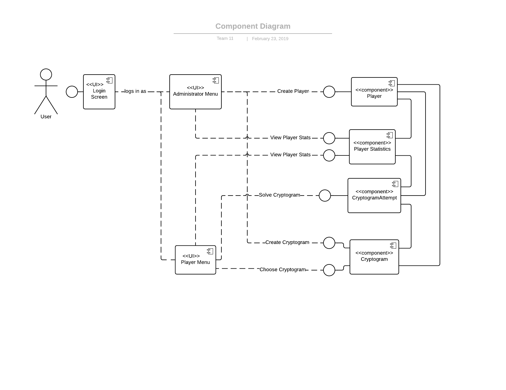
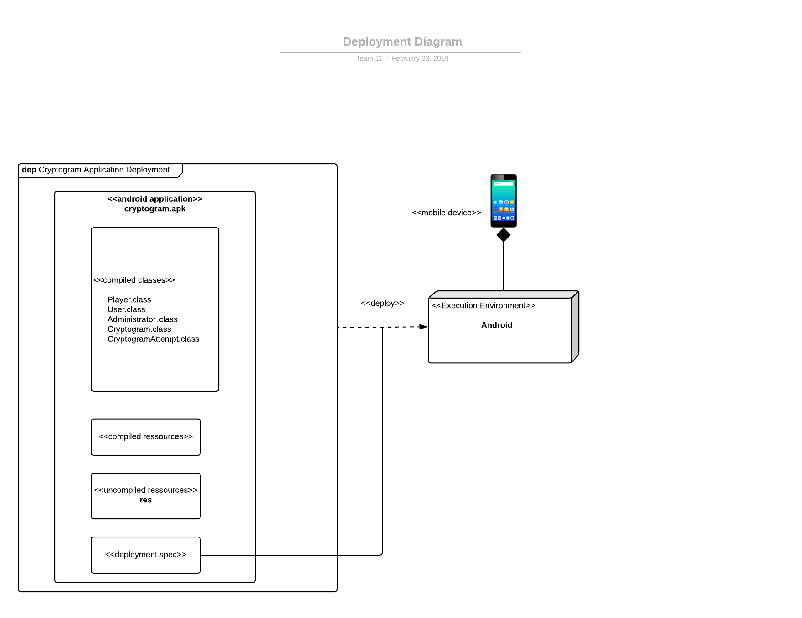
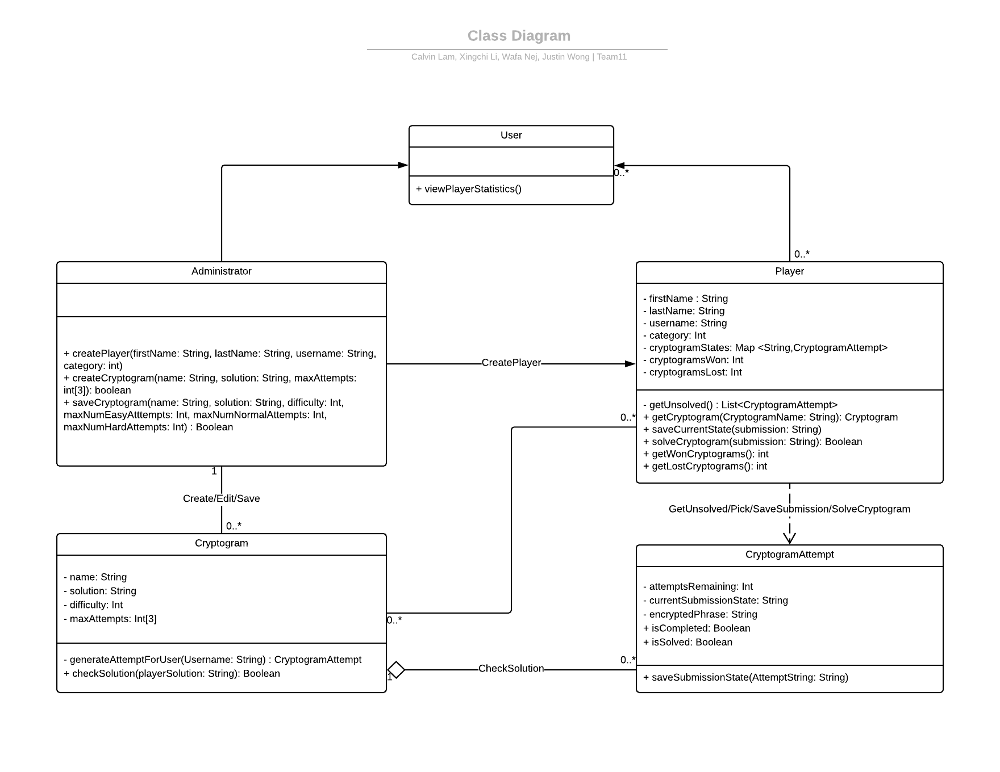
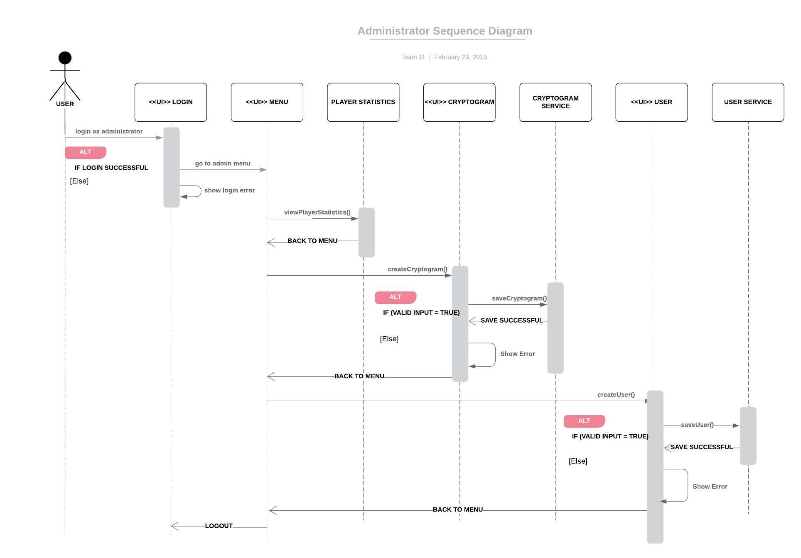
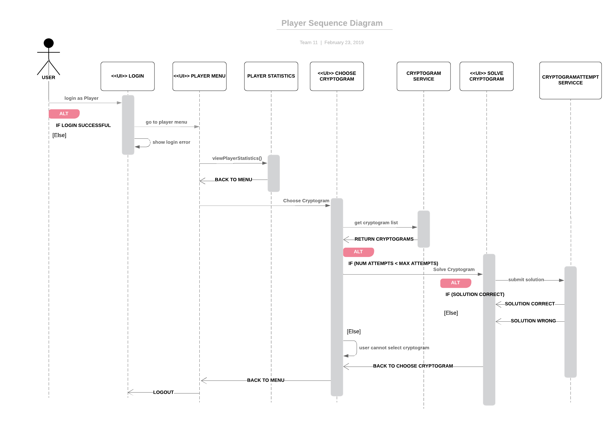
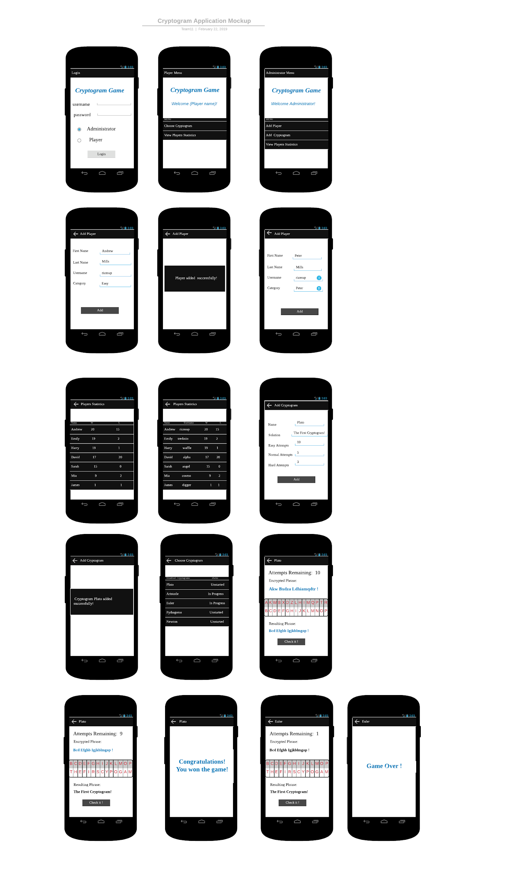

# Design Document

**Author**: Team 11

## 1 Design Considerations

### 1.1 Assumptions

1. Any user will access one cryptogram at the same time
2. Any user will save the current state of the cryptogram before log off
3. Any user or administrator will login on one machine at the same time
4. Any user will not do conflict operations, for example, under certain circumstances, he/she successfully logs in at different machines and do the same operation at the same time
5. The machine users run our app on should have all the libraries required for the application to run successfully
6. Any administrator won’t make changes to any user that is currently active
7. Any administrator won’t make changes to any cryptogram that is current actively used by some user

### 1.2 Constraints

1. Any user can access only one cryptogram at the same time
2. Current state of cryptogram is stored when users sign off
3. Any user or administrator remain active on only one machine at the same time
4. Any administrator can’t make changes to any user that is currently active
5. Any administrator can’t make changes to any cryptogram that is current actively used by some user

### 1.3 System Environment

* Android phones running on API 23 or higher.
* RAM >= 512MB
* Resolution >= 720p
* CPU frequency >= 1.5 GHz
* Network access

## 2 Architectural Design

### 2.1 Component Diagram

In the component diagram above, the user interacts first with the Login Screen and then proceeds to either an Administrator or Player Menu UI.  From either one of these menus, they are able to interact with the components: Player, Player Statistics, Cryptogram, or CryptogramAttempt.  

The four components are linked together with solid lines to indicate the various association and dependency relationships they have.  These relationships include `Player-PlayerStatistic`, `Player-CryptogramAttempt`, `Player-Cryptogram`, `CryptogramAttempt-PlayerStatistic`, and `Cryptogram-CryptogramAttempt`.

Finally, we see that the menus interface with each these components.  The labels from the menu to the components indicate how the user will ultimately interact with them.  In the case of the menus interacting with the Player Statistics, it should be noted that the Administrator has additional permissions allowing them to see more information than a Player User. 

### 2.2 Deployment Diagram

The Deployment Diagram above shows the main compiled classes as part of an overall Android app.  The User will then interact directly with this .apk file as an app on their Android phone or tablet.

## 3 Low-Level Design

### 3.1 Class Diagram

The class diagram below represents the main classes used in the Cryptogram app.  This design is presented unmodified from the previous Deliverable submission.

### 3.2 Other Diagrams

#### 3.2.1 Administrator Sequence Diagram

In the Administrator Sequence Diagram above, the user logs in as an Administrator and proceeds to the menu view.  If they are unable to login successfully they are booted back out to the login screen.  The Administrator is able to access the Player Statistics, Cryptogram UI, and User UI, from the Menu UI.

When the Administrator tries to create a cryptogram, they will send their request to the `Cryptogram` class service.  If the data for this cryptogram is valid, then the information is saved successfully otherwise an error will occur.

Similarly for when the Administrator wants to create a Player, they must go to the User UI view.  They can save the new `User` data by sending a request to the `User` class service.  If the data is considered valid by the service, the save will be successful otherwise an error occurs.  

Finally, the Administrator can return back to the menu at any time.  They can also _logout_ to return back to the Login UI.

#### 3.2.2 Player Sequence Diagram

In the Player Sequence Diagram, the user will proceed to the Player Menu UI if they log in successfully at the Player.  If the login credentials are wrong, they will be returned back to the Login screen.  The Player when logged in, can then go to the Player Statistics screen or Choose Cryptogram.  

On the Choose Cryptogram UI, the app will retrieve a list of all the cryptograms from the Cryptogram service to populate the view.  The Player can then select one of the Cryptograms that are unsolved or in-progress to play.  Completed cryptograms, whether solved or unsolved, will not be selectable by the Player.

When the Player selects an unsolved or in-progress cryptogram, they will then go to the Solve Cryptogram UI.  Here they can attempt a cryptogram and submit a solution.  This submission will then be sent to the CryptogramAttempt service to validate whether it is a correct solution or not.  If the Player’s solution is incorrect, they will be returned back to the Solve Cryptogram screen if they have attempts remaining.  If they solve the cryptogram or do not have any attempts remaining for their difficulty, they will be shown a dialog and returned back to the Choose Cryptogram screen.

Finally, the Player can return back to the Player menu.  From there they can completely logout.

## 4 User Interface Design

