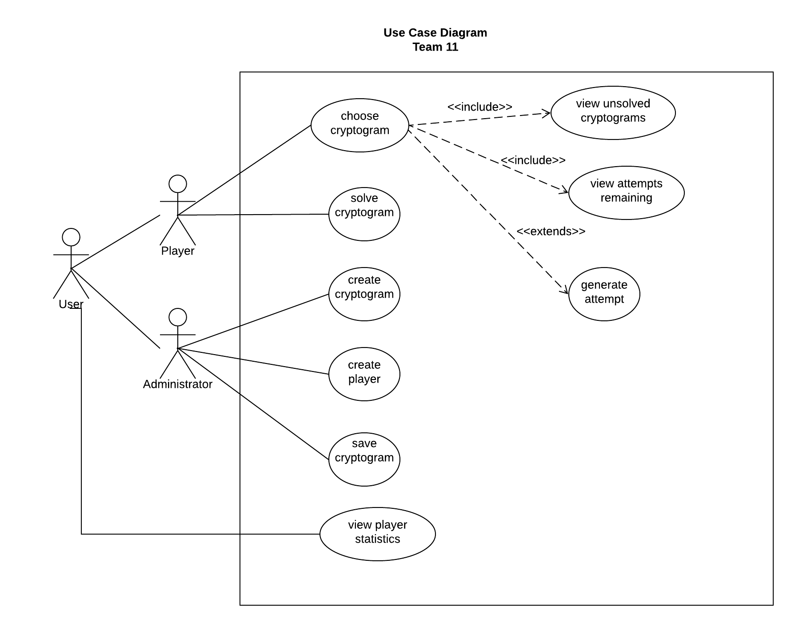

# Use Case Model

**Author**: Team 11

## 1 Use Case Diagram

## 2 Use Case Descriptions

### 2.1 User Use Cases

#### 2.1.1 View Player Statistics
**Requirements**: this use case allows a user (a player or the administrator ) to view the list of players statistics.
 **Pre-conditions**: the user must have been logged in successfully and selected /pressed the view player statistics option/button.
 **Post-conditions**: A list containing players first name, number of cryptograms won and number of cryptograms lost is displayed. The list is ordered by the number of cryptograms won. If the user is the administrator, he can also see players username and difficulty status..
 **Scenarios**:
* The user is a player:
  * The player select /press the view player statistics option/button.
  * A list containing players first name, number of cryptograms won and number of cryptograms lost is displayed.
* The user is the administrator:
  * The administrator select /press the view player statistics option/button.
  * A list containing players username,  first name, difficulty status, number of cryptograms won and number of cryptograms lost is displayed.

### 2.2 **Administrator Use Cases**

#### 2.2.1 **Create Player**
**Requirements**: this use case allows the administrator to add a new player.
 **Pre-conditions**: the administrator must have been logged in successfully, chose/pressed  the add player option/button.
 **Post-conditions**: a confirmation that the new player has been added is displayed if all the required fields are entered, or an error message if there are missing or incorrect information entered.
 **Scenarios**:
* **Scenario 1**
  * The administrator enters the player’s first and last name.
  * The administrator enters the username. 
  * The administrator enters the difficulty category. 
  * All fields are validated and the new player is added to the list of players.
  * A confirmation message is displayed.
* **Scenario 2**
  * Do the first 3 steps of scenario 1.
  * There is an empty field, the entered first or last name are not alphabetic, the entered username already exists or the entered string for difficulty is other than easy, normal or hard. An error is displayed near each of the corresponding fields and the new player is not added to the list of players.

#### 2.2.2 **Create Cryptogram**
**Requirements**: this use case allows the administrator to add a new cryptogram.
 **Pre-conditions**:  the administrator must have been logged in successfully, chose/pressed  the add cryptogram option/button.
 **Post-conditions**:  a confirmation that the new cryptogram has been added is displayed if all the required fields are entered, or an error message if there are missing or incorrect information entered.
 **Scenarios**:
* **Scenario 1**
  * The administrator enters the cryptogram name. 
  * The administrator enters the solution phrase.
  * The administrator enters the number of allowed incorrect solution attempts for the easy, normal and hard difficulty. 
  * The administrator edit any of the mentioned fields.
  * The administrator push the save button.
  * All fields are validated and the new cryptogram is added to the list of cryptograms. 
* **Scenario 2**
  * Do the same scenario 1 steps, except the last step.
  * There is an empty field, the entered name already exists or the entered string for the number of allowed incorrect solution attempts for the easy, normal and hard difficulty is not a number. An error is displayed near each of the corresponding fields and the new cryptogram is not added to the list of cryptograms.
  * The administrator edit any of the mentioned fields.

### 2.3 **Player Use Cases**

#### 2.3.1 **Choose Cryptogram**
**Requirements**: this use case allows the player to choose a cryptogram.
 **Pre-conditions**: the player must have been logged in successfully, chose/pressed  the view unsolved cryptograms option/button.
 **Post-Conditions**:  If the chosen cryptogram has not been played by the player before, the fully encrypted phrase is generated and displayed.  If the cryptogram is in progress, the previous state of the phrase is displayed.

 **Scenarios**: 
* A list of unsolved cryptograms is displayed.
* The player selects a cryptogram from the displayed list.
* **Scenario 1**: 
  * The status of the chosen cryptogram is unstarted. A fully encrypted phrase is generated (a cryptogramAttempt) and displayed.
  * The number of incorrect solution attempts remaining is displayed.
* **Scenario 2**: 
  * The status of the chosen cryptogram is in progress. The previous state of the phrase is displayed.
  * The number of incorrect solution attempts remaining is displayed.

#### 2.3.2 **View Unsolved Cryptograms**
 **Requirements**: this use case allows the player to view the list of unsolved   cryptograms. It is a requirement for the choose cryptogram use case.
 **Pre-conditions**: the player must have been logged in successfully, chose/pressed  the view unsolved cryptograms option/button.
 **Post-conditions**: A list of unsolved cryptograms for the specific player,  alongside their status as in progress or unstarted is displayed.
 **Scenarios**:
* Display the list of all unsolved cryptograms for the player.

#### 2.3.3 **View Attempts Remaining**
 **Requirements**: this use case allows the player to view the number of attempts remaining for the chosen cryptogram.
 **Pre-conditions**: the player must have chosen a cryptogam to solve.
 **Post-conditions**: the number of incorrect solution attempts remaining is displayed.
 **Scenarios**: 
* **Scenario 1**
  * The chosen cryptogram is new. The number of incorrect solution  attempts remaining is the the number of allowed incorrect solution attempts (created by the administrator) for the player difficulty category.
* **Scenario 2**
  * The chosen cryptogram is in progress.  The number of incorrect solution  attempts remaining is the last value of attempts remaining for this cryptogram attempt. 

#### 2.3.4 **Generate Attempt**
**Requirements**: this use case allows the player to generate and display a fully encrypted phrase, when he chooses a new cryptogram.
 **Pre-conditions**: the player chooses a cryptogram  having as status unstarted.
 **Post-conditions**: the encrypted phrase is generated.
  **Scenarios**:
*  The encrypted phrase is added the player cryptogram attempt.
*  The submission status of the cryptogram attempt is changed to in progress.

#### 2.3.5 **Solve Cryptogram**
**Requirements**: this use case allows the player to solve the cryptogram.
 **Pre-conditions**: the player must have chosen a cryptogram to solve.
 **Post-conditions**: the cryptogram status is updated based on the proposed solution.
 **Scenarios**:
* The player submit the pairs of encrypted and replacement letters.
* Replace all letters in the cryptogram with the proposed replacements.
* Compare the resulting string to the solution.
* **Scenario 1**
  * The resulting string matches the solution.
  * Display that the solution was successful.
  * Mark the cryptogram attempt as complete.
  * Remove the cryptogram attempt from the list of unsolved cryptograms.
  * Increment the number of cryptograms won.
* **Scenario 2**
  * The resulting string doesn’t match the solution.
    * **Scenario A**
      * The number of incorrect solution  attempts remaining is greater  than 1.
      * Display that the solution was unsuccessful.
      * Decrement the number of incorrect solution  attempts remaining.
      * Save the proposed solution.
    * **Scenario B**
      * The number of incorrect solution attempts remaining is 1.
      * Display that the cryptogram game was lost.
      * Mark the cryptogram attempt as complete.
      * Remove the cryptogram attempt from the list of unsolved cryptograms.
      * Increment the number of cryptograms lost.
